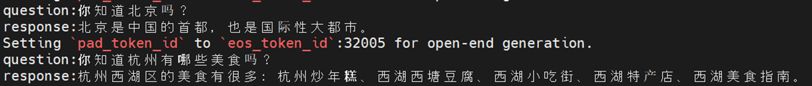
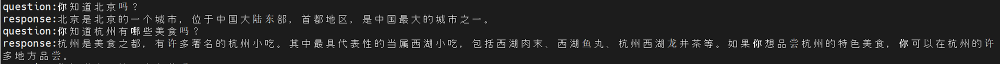
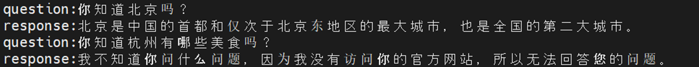

# Zero-Chatgpt   

  

 

本开源项目的目的是想从0开始，将chatgpt的技术路线跑一遍。  
包括：数据收集 -> 数据清洗和去重 -> 词表训练 -> 语言模型预训练 -> 指令微调 -> 强化学习（rlhf，ppo）。  
最主要的是把代码和流程跑通，效果有时间再调优。  
预训练数据：10B token，指令微调数据：30w条，rlhf数据：10w条，模型大小：0.1B。  
训练流程和代码都已经跑通，想要更好的效果的话可以直接调整模型配置文件做scaling up，这边训练的经验看更大的模型、更多的数据对于效果的提升是十分明显的。  
## 一、训练环境  
cuda 12.1、pytorch、transformers、deepspeed等常用的环境，这里的requirements.txt是运行环境的介绍的列表。  

## 二、训练数据、模型权重和训练镜像文件  
[微调数据、rlhf数据、模型权重、预训练和指令微调镜像（强化学习稍后上传）](https://huggingface.co/My521/Zero-Chatgpt/tree/main)都放在这里了，模型权重去掉前缀名后（修改为model.safetensors或者pytorch_model.bin）和模型代码、配置文件放在一起（model文件夹下）就可以加载了。预训练数据、训练镜像太大，稍后上传。  

| 文件名称               | 文件介绍                                                |
|------------------------|--------------------------------------------------------|
| [pretrain_model.safetensors](https://huggingface.co/My521/Zero-Chatgpt/blob/main/pretrain_model.safetensors) | 预训练模型的权重文件|
| [pretrain_model.safetensors](https://huggingface.co/My521/Zero-Chatgpt/blob/main/sft_model.safetensors) | 指令微调后模型的权重文件|
| [rlhf_pytorch_model.bin](https://huggingface.co/My521/Zero-Chatgpt/blob/main/rlhf_pytorch_model.bin) | rlhf后的模型权重文件|
| [pretrain_sft.tar](https://huggingface.co/My521/Zero-Chatgpt/blob/main/pretrain_sft.tar)       | 预训练和sft运行镜像|
| [rlhf.jsonl](https://huggingface.co/My521/Zero-Chatgpt/blob/main/rlhf.jsonl)             | rlhf数据集|
| [sft.jsonl](https://huggingface.co/My521/Zero-Chatgpt/blob/main/sft.jsonl)              | sft数据|

## 三、数据收集和清洗  
本项目一共收集了10B左右的中文训练语料，包括[中文维基百科](https://huggingface.co/datasets/pleisto/wikipedia-cn-20230720-filtered/blob/main/wikipedia-cn-20230720-filtered.json)，[中文百度百科](https://huggingface.co/datasets/xuqinyang/BaiduBaike-5.63M/blob/main/563w_baidubaike.json)和[SkyPile-150B](https://huggingface.co/datasets/Skywork/SkyPile-150B)随机抽取了部分数据。  

中文维基百科和SkyPile-150B数据比较干净，只对中文百度百科进行了清洗和去重。去除了一些人物介绍、产品介绍和长度比较短的数据，并进行了严格的去重，最终563w条数据只剩下140多w条数据。  

数据处理的代码在data_process文件夹下。  

## 四、Tokenizer训练  
从3类数据中随机抽取了部分数据（取决你服务器内存大小，本项目抽取了1.5G文本）训练。词表大小设置为32000（参考llama），因为这里模型设置的比较小，为了避免模型头重脚轻（embedding层参数占比太高），所以词表也比较小。special_tokens参考qwen设置。    

tokenizer训练的代码在train_tokenizer文件夹下。

## 五、预训练
模型结构参考llama（这也是大多数开源模型的选择），模型代码参考huggingface的代码（之前训练代码不兼容huggingface，进行rlhf的时候坑太多，后面改了）。这里考虑到手头目前可以使用的计算资源，模型大小设计为0.1B左右，计算资源多的可以对模型和数据进行scaling。训练过更大的模型和更多的数据，更大的模型和更多的数据效果就是更好，差异还是很明显的。

首先对数据进行分词，生成.bin文件，然后使用huggingface的trainer进行训练。

预训练数据生成代码、训练脚本、训练代码在pretrain文件夹下。

## 六、指令微调  
这里指令微调的数据使用了[firefly-train-1.1M](https://huggingface.co/datasets/YeungNLP/firefly-train-1.1M/blob/main/firefly-train-1.1M.jsonl)，[ruozhiout_qa_cn.jsonl](https://www.modelscope.cn/datasets/baicai003/Llama3-Chinese-dataset/files)。  

firefly-train-1.1M的数据质量不是特别高，这里根据问题长度对数据集进行了清洗和去重，最后剩余40多w条数据。因为模型尺寸比较小，只想训练单论对话能力，这里也只保留了单轮对话数据。

sft过程使用了30w条数据，效果也不是很好，可能是因为模型尺寸的原因。之前尝试使用50B token训练了1.5B的模型，2w条训练数据就有比较好的对话能力，这里0.1B的模型2w条sft数据训练后对话能力还是比较差，需要更多的sft数据训练，这里用了30w条。

指令微调的脚本和代码在sft文件夹下面。  

微调后模型简单测试结果：  
  

## 七、强化学习  
强化学习的数据是根据sft没有使用的数据进行生成的，sft数据原有的回答为"chosen"，使用之前指令微调后的模型生成的回答作为"rejected"，一共生成了10w条数据。rlhf的代码参考[DeepSpeed-Chat](https://github.com/microsoft/DeepSpeedExamples/tree/master/applications/DeepSpeed-Chat#readme)并进行了一定的修改。

其中5w条数据用来训练Reward Model（step 2），1个epoch后分类准确率可以达到92%。  

所有10w条数据用来训练Reinforcement Learning with Human Feedback（step 3）。  

从最后的训练结果看，rlhf的效果并不好，随着训练步数的增加，模型能力反而下降了（训练步数比较小的时候效果还可以），拒绝回答的频率增加了，但是复读机的频率降低了。一开始考虑可能是学习率设置的比较大的原因，降低学习率后会有一定的缓解，但是效果仍然不是很好，可能还是数据的质量比较差。  

强化学习的脚本和代码在rlhf文件夹下面。  

训练步数比较少的时候的回答：  
  

训练步数比较多的时候的回答：  
  

